# BigBanana AI Director (AI 漫剧工场)

> **AI 一站式短剧/漫剧生成平台**
> *Industrial AI Motion Comic & Video Workbench*

[](./README.md)
[](./README_EN.md)
[](./README_JA.md)
[](https://creativecommons.org/licenses/by-nc-sa/4.0/)

**BigBanana AI Director** 是面向创作者的 **AI 短剧/漫剧生产平台**，采用 **「小说 → 剧本 → 分镜 → 资产 → 关键帧 → 成片」** 的工业化工作流，支持**多模型提供商**，从灵感到成片一站式完成。

- **前后端分离**：React 前端 + Express 后端，数据持久化于 MySQL，用户隔离。
- **小说与剧本**：支持上传小说文件、自动解析章节，选章生成剧集剧本；也支持直接输入故事/剧本生成分镜。
- **分镜与资产**：分镜可编辑（角色、提示词、动作、台词），角色定妆与场景概念图保证画面一致性。
- **关键帧驱动**：首帧/首尾帧控制运镜，多厂商图像与视频模型可选。

---

## 界面展示

### 项目管理
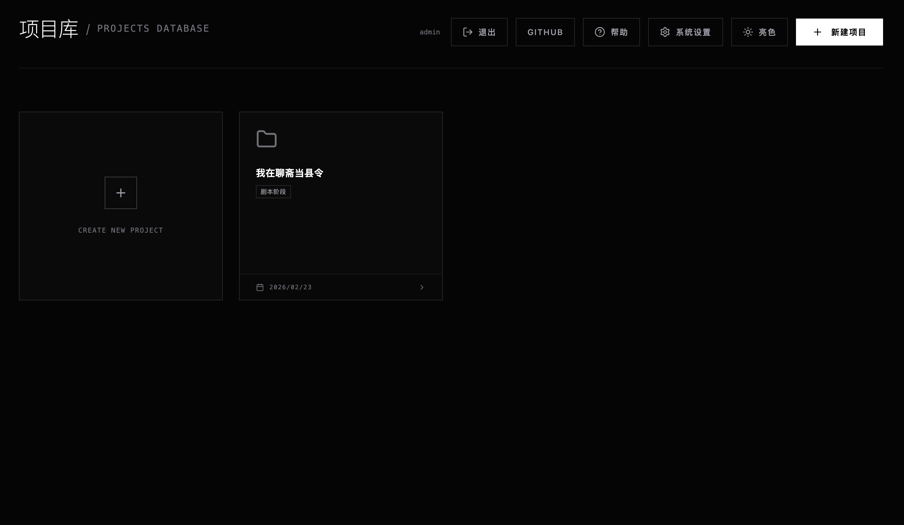

### Phase 01: 剧本与分镜
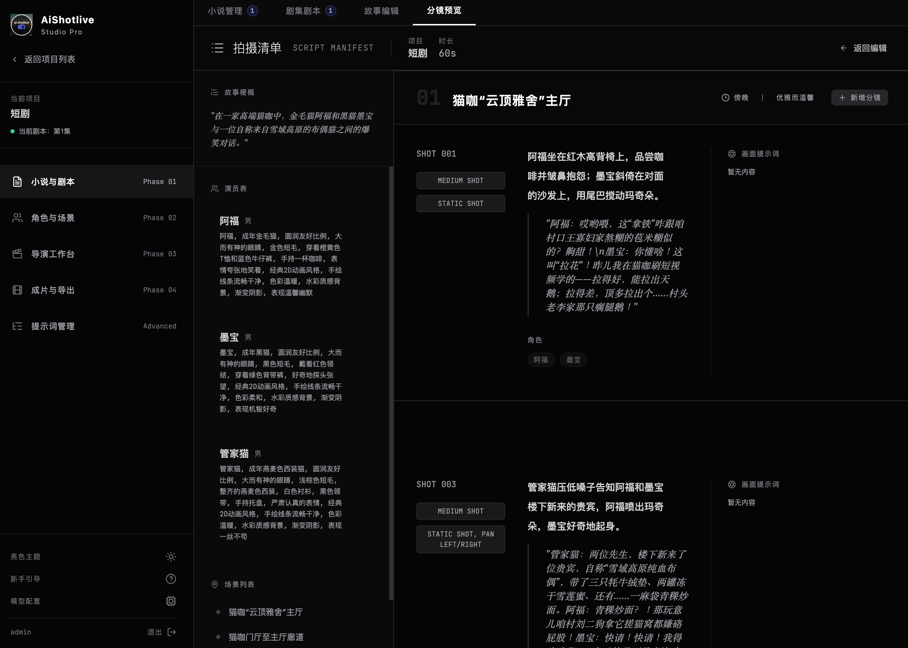
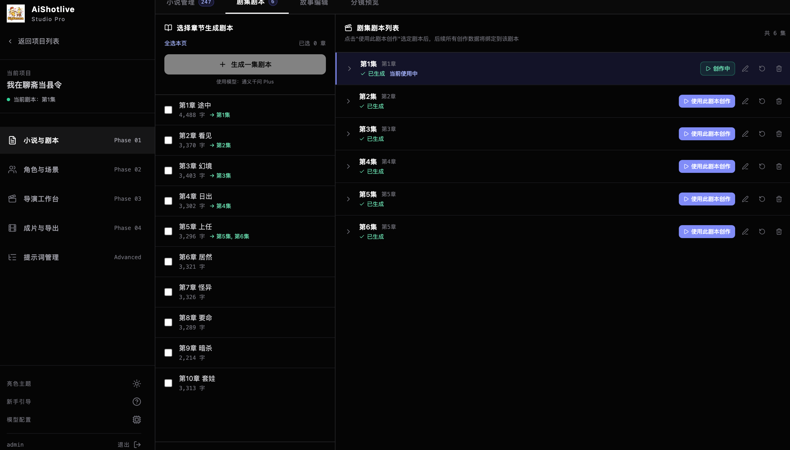

### Phase 02: 角色与场景资产
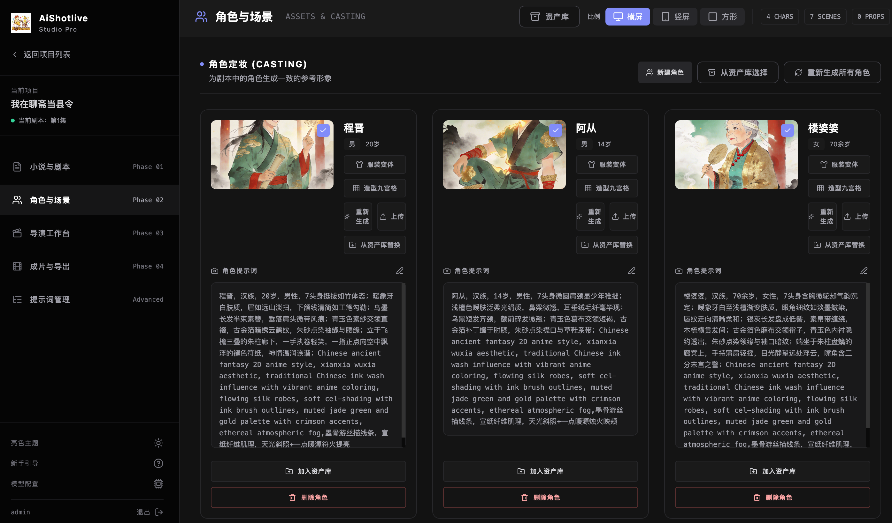
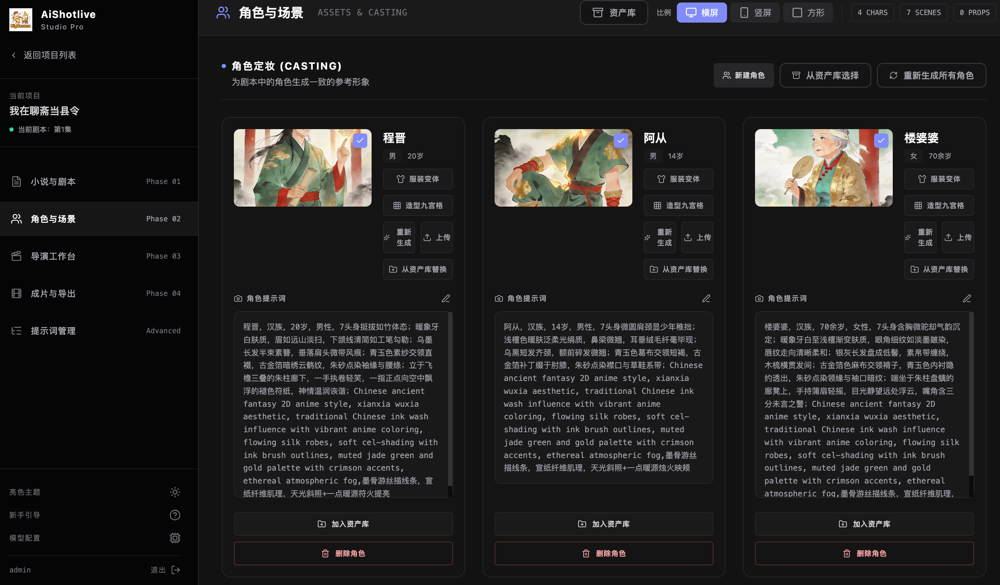

### Phase 03: 导演工作台
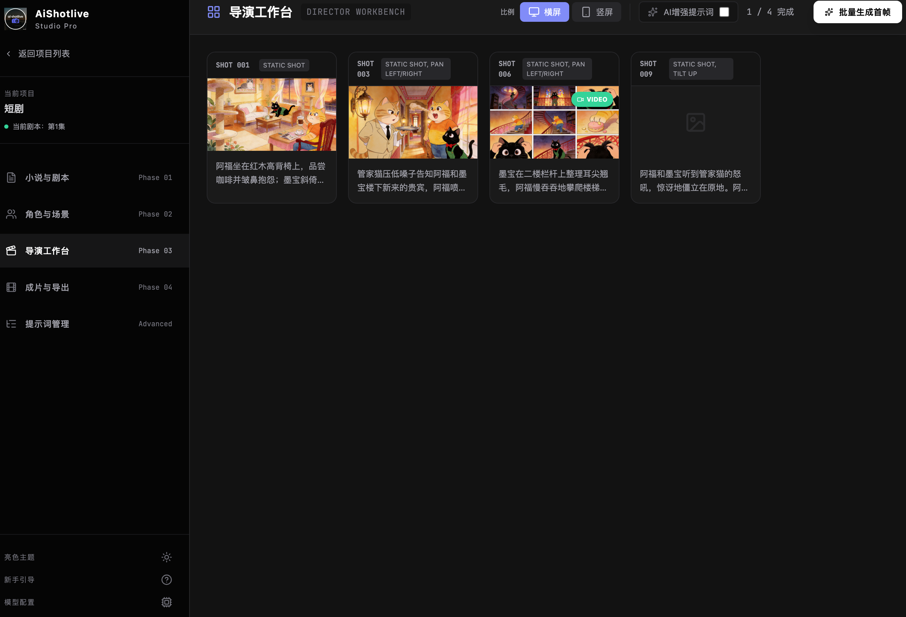
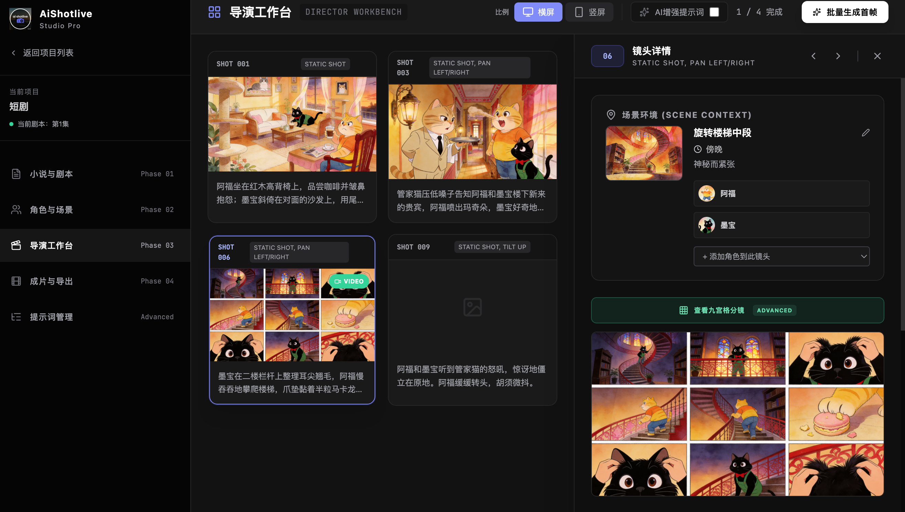
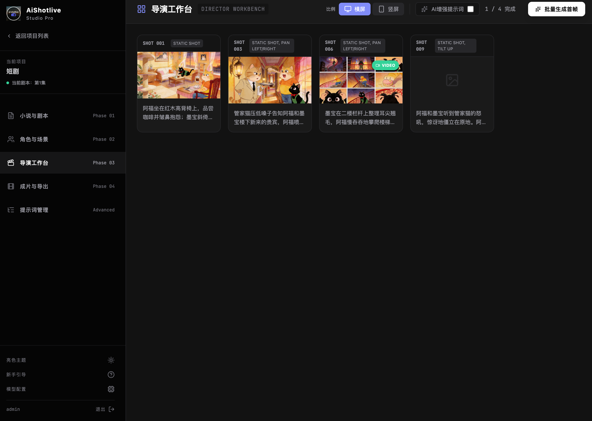
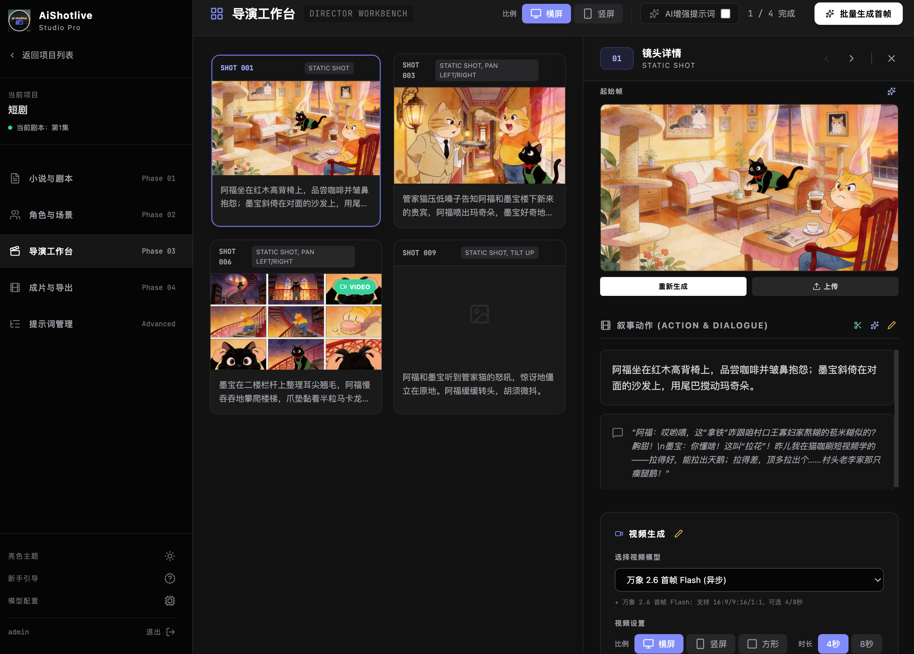

### Phase 04: 成片导出
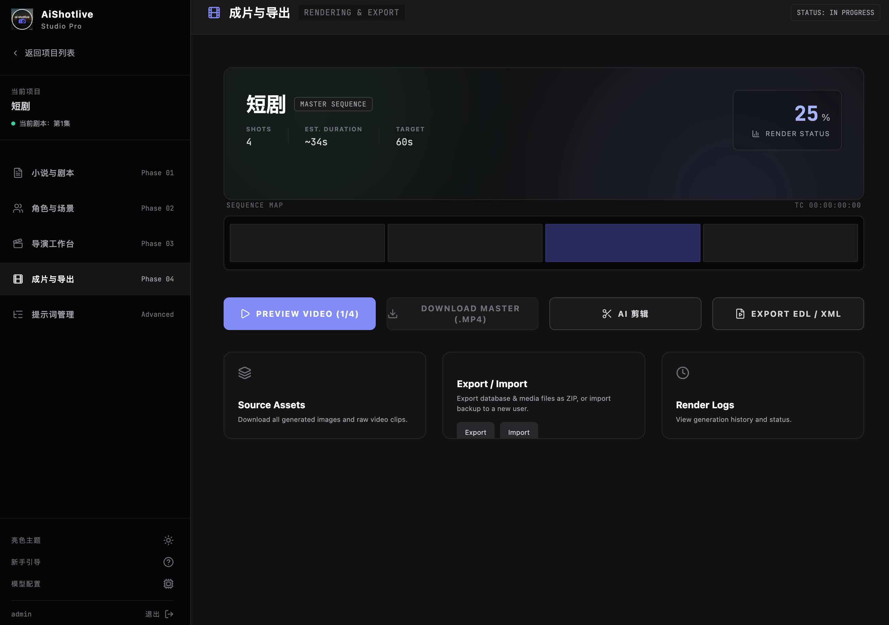

### 提示词管理
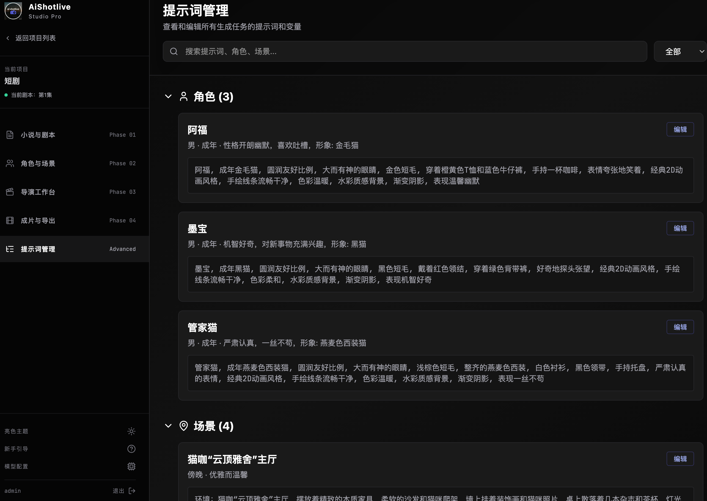

---

## 核心理念：关键帧驱动 (Keyframe-Driven)

- **先画后动**：先生成起始帧与结束帧，再在中间插值生成视频。
- **资产约束**：画面生成受「角色定妆照」和「场景概念图」约束，保证人物与场景一致。
- **多模型支持**：文本/图像/视频可分别选用不同厂商与模型（如 OpenAI、Google、豆包、通义、可灵、万象等）。

---

## 核心功能模块

### Phase 01: 剧本与分镜 (Script & Storyboard)

- **小说 → 剧本**
  - 上传 `.txt` 小说文件，系统按「第 X 章」自动解析章节。
  - 选择章节创建剧集，AI 将选定章节改编为一集剧本（场次、对话、动作、视觉化描述）。
- **故事/剧本输入**：直接粘贴故事大纲或剧本，AI 拆解为场次、时间、气氛与分镜结构。
- **视觉化翻译**：将剧本描述转为绘图提示词，支持设定目标时长与镜头密度。
- **手动编辑**：可编辑角色视觉描述、分镜提示词、分镜内角色列表、动作与台词，精细控制生成效果。

### Phase 02: 资产与选角 (Assets & Casting)

- **角色定妆**：为角色生成参考图；衣橱系统支持多套造型（日常、战斗等），保持面部一致。
- **场景概念**：生成场景参考图，保证同场景下镜头光影统一。
- **道具**：支持道具资产上传与管理。

### Phase 03: 导演工作台 (Director Workbench)

- **分镜表**：网格化管理所有镜头。
- **首帧 / 尾帧**：生成并可选编辑首帧与结束帧，支持首尾帧插值成片。
- **九宫格分镜**：同一镜头 9 个视角预览，可选用整图或单格作为首帧。
- **上下文感知**：生成时自动带入当前场景图与角色服装图，减少「不连戏」。
- **视频模式**：支持单图图生视频 (I2V) 与首尾帧插值，按所选视频模型切换。

### Phase 04: 成片与导出 (Export)

- 时间轴预览、渲染进度追踪，导出高清关键帧与 MP4 片段，便于后期剪辑。

---

## 多模型支持

项目支持**多模型提供商**，文本、图像、视频可分别配置 API Key 与当前使用模型。

| 类型 | 支持厂商示例 |
|------|----------------|
| **文本 (Chat)** | OpenAI、Anthropic、DeepSeek、豆包、通义千问、智谱、Google Gemini、xAI、AntSK、SiliconFlow、Moonshot、OpenRouter 等 |
| **图像 (Image)** | Google Gemini、豆包 Seedream、通义万相、可灵 Image（AntSK）等 |
| **视频 (Video)** | Veo 3.1 / Sora-2（AntSK/OpenAI）、豆包 Seedance、可灵、Vidu、万象（通义）等 |

- 在 **模型配置** 中为各提供商填写 API Key，并选择当前激活的文本/图像/视频模型。
- 默认推荐使用 [**AntSK API**](https://api.antsk.cn/) 一站式调用多类模型；也可使用各厂商官方 API，按需切换。

---

## 技术架构

| 层级 | 技术 |
|------|------|
| **前端** | React 19, Vite, Tailwind CSS |
| **后端** | Express.js, MySQL, JWT 认证 |
| **AI** | 多厂商文本/图像/视频 API，适配器层统一调用（见 `services/adapters`、`types/model.ts`） |
| **存储** | MySQL 持久化项目、资产、模型配置、用户偏好；用户数据按 `user_id` 隔离 |
| **文件** | 小说等上传文件存于服务端 `uploads/`，按用户隔离 |

---

## ⚠️ 开源与使用说明

- **模型与费用**：工作流依赖大语言模型、图像模型、视频模型等，需自行配置相应 API Key 并承担调用费用；项目不绑定单一厂商，可替换为 OpenAI、Google、豆包、通义等。
- **开源目的**：降低使用与集成门槛，代码与模型配置均可修改、扩展。
- 若希望长期「完全免费」使用，本仓库可能不适合；可搭配各厂商免费额度或选用其他产品。

---

## 环境要求

- **Node.js** >= 20
- **MySQL** >= 5.7（推荐 8.0+）
- **npm** >= 9

---

## 项目启动

### 1. 环境配置

```bash
git clone https://github.com/shuyu-labs/BigBanana-AI-Director.git
cd BigBanana-AI-Director

npm install
cp .env.example .env
```

编辑 `.env`，配置数据库与 JWT：

```env
DB_HOST=127.0.0.1
DB_PORT=3306
DB_USER=banana
DB_PASSWORD=banana
DB_NAME=banana

JWT_SECRET=bigbanana_jwt_secret_change_me_in_production
SERVER_PORT=3001
NODE_ENV=development
```

### 2. 初始化数据库与默认用户

首次启动时服务端会**自动建表**。可选：创建默认管理员并导入备份数据：

```bash
# 默认账号 admin / admin123
npx tsx server/src/scripts/seed.ts

# 并导入浏览器导出的项目备份
npx tsx server/src/scripts/seed.ts ./your-backup.json
```

### 3. 启动方式

**本地开发（前端 + 后端同时启动）：**

```bash
npm run dev
# 前端: http://localhost:3000  后端 API: http://localhost:3001
```

**Docker 部署：**

```bash
docker-compose up -d --build
# 访问: http://localhost:3005
```

**生产构建：**

```bash
npm run build
NODE_ENV=production npm start
```

**其他命令：** `npm run build:client` / `npm run build:server` / `npm run preview`；Docker 无缓存重建：`docker-compose build --no-cache && docker-compose up -d --force-recreate`。

---

## 项目结构

```
BigBanana-AI-Director/
├── .env / .env.example      # 环境变量
├── docker-compose.yaml      # Docker 编排
├── package.json / vite.config.ts
├── App.tsx, index.tsx, types.ts
├── types/model.ts           # 模型与提供商类型、内置模型列表
├── components/              # 前端组件
│   ├── Login.tsx, Dashboard.tsx, Sidebar.tsx
│   ├── StageScript/         # Phase 01：小说/剧集/故事/剧本与分镜
│   │   ├── NovelManager.tsx # 小说上传与章节解析
│   │   ├── EpisodeManager.tsx # 剧集与剧本生成
│   │   ├── ScriptEditor.tsx, SceneBreakdown.tsx, ConfigPanel.tsx
│   ├── StageAssets/         # Phase 02：角色/场景/道具资产
│   ├── StageDirector/       # Phase 03：导演工作台与关键帧
│   ├── StageExport/         # Phase 04：成片导出
│   ├── StagePrompts/        # 提示词管理
│   ├── ModelConfig/         # 模型配置（多提供商、API Key、激活模型）
│   └── Onboarding/
├── contexts/                # AuthContext, ThemeContext
├── services/                # 前端服务
│   ├── apiClient.ts, storageService.ts
│   ├── modelRegistry.ts, modelConfigService.ts
│   ├── novelParser.ts       # 小说章节解析
│   ├── ai/
│   │   ├── novelScriptService.ts  # 小说 → 剧集剧本
│   │   ├── scriptService.ts, visualService.ts, shotService.ts, videoService.ts
│   │   └── apiCore.ts, promptConstants.ts
│   ├── adapters/            # chat / image / video 多厂商适配器
│   └── projectPatchService.ts, taskService.ts, exportService.ts 等
├── server/                  # Express 后端
│   └── src/
│       ├── index.ts
│       ├── config/database.ts
│       ├── middleware/auth.ts
│       ├── routes/
│       │   ├── auth.ts, projects.ts, assets.ts, models.ts
│       │   ├── uploads.ts   # 小说等文件上传
│       │   ├── tasks.ts     # 异步任务
│       │   ├── projectPatch.ts
│       │   └── preferences.ts
│       └── scripts/seed.ts
└── uploads/                 # 用户上传文件（按用户隔离）
```

---

## 数据库设计

| 表名 | 说明 | 用户隔离 |
|------|------|---------|
| `users` | 用户账号 | - |
| `projects` | 项目完整状态（含剧本、分镜、小说章节、剧集等） | 按 user_id |
| `asset_library` | 角色/场景/道具资产 | 按 user_id |
| `model_registry` | 模型配置（提供商、API Key、激活模型） | 按 user_id |
| `user_preferences` | 主题、引导状态等 | 按 user_id |

---

## 快速开始

1. **登录**：使用默认账号（admin / admin123）或注册新用户。
2. **配置模型**：在「模型配置」中为需要的厂商填写 API Key，并选择当前文本/图像/视频模型。
3. **剧本来源二选一**：
   - **小说**：Phase 01 上传 `.txt` 小说 → 解析章节 → 选择章节创建剧集 → 生成该集剧本；
   - **故事/剧本**：直接粘贴故事或剧本 → 生成分镜脚本。
4. **资产**：Phase 02 生成角色定妆与场景概念图。
5. **分镜与成片**：Phase 03 生成首帧（及可选尾帧），可选九宫格选构图，再选视频模型生成片段；Phase 04 预览与导出。

---

**Windows 客户端**（开箱即用）：[下载 BigBanana AI Director 安装包](https://tree456.oss-cn-beijing.aliyuncs.com/BigBanana%20AI%20Director%20Setup%201.0.0.exe?Expires=1770908400&OSSAccessKeyId=TMP.3KofXPaUNdnvbUpRP5MqiRmMMxuGwiftTgQfn7U3ntRtFvMYHpMB2kPb17r7rPXksvo7DFncrz4dWSfs3K33wVgGXfnCy4&Signature=wiOZbN%2BcZNuyZdiEI3KR1CqkFhM%3D)

**轻量创作工具**：[BigBanana 创作工坊](https://bigbanana.tree456.com/) — AI 绘图、PPT、视频、小红书文案、小说、动漫等，浏览器即用。本项目更适合**系统化短剧制作与工业化工作流**。

---

## 项目来源

基于 [CineGen-AI](https://github.com/Will-Water/CineGen-AI) 二次开发，增加小说→剧本、多模型提供商、前后端分离与数据持久化等能力。感谢原作者的开源贡献。

---

## 许可证

[CC BY-NC-SA 4.0](https://creativecommons.org/licenses/by-nc-sa/4.0/) — 允许个人与非商业使用及在相同许可下修改与二次创作；商业使用需获得授权。联系：antskpro@qq.com

*Built for Creators, by BigBanana.*
